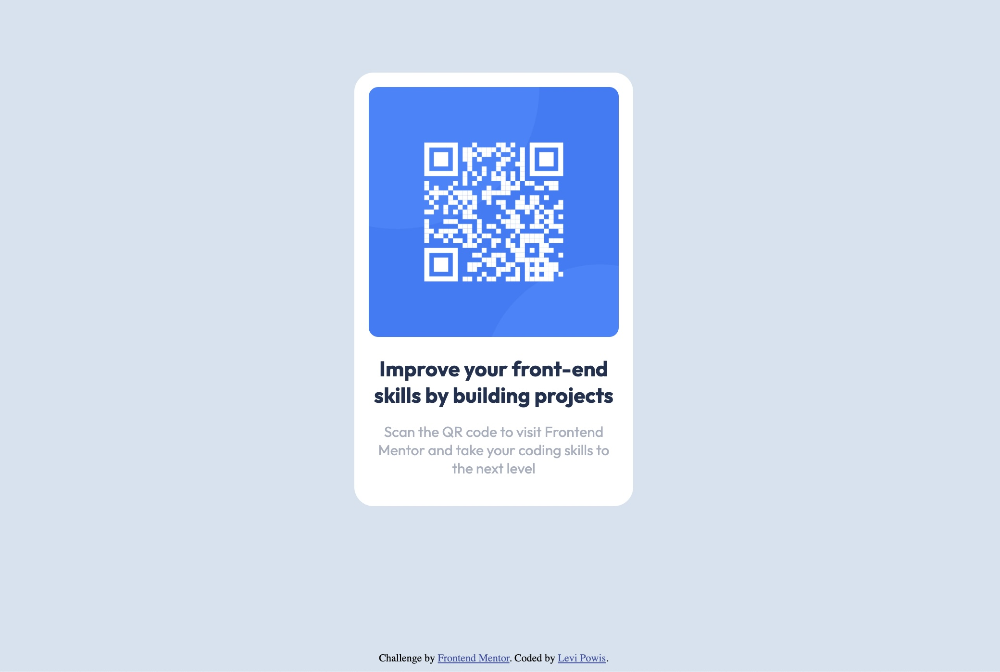

# Frontend Mentor - QR code component solution

This is a solution to the [QR code component challenge on Frontend Mentor](https://www.frontendmentor.io/challenges/qr-code-component-iux_sIO_H). Frontend Mentor challenges help you improve your coding skills by building realistic projects.

## Table of contents

- [Overview](#overview)
  - [Screenshot](#screenshot)
  - [Links](#links)
- [My process](#my-process)
  - [Built with](#built-with)
  - [What I learned](#what-i-learned)
  - [Continued development](#continued-development)
  - [Useful resources](#useful-resources)
- [Author](#author)

## Overview

### Screenshot

### Links

[Live Site URL](https://levipowis.github.io/qr-code-component/)

## My process

### Built with

- Semantic HTML5 markup
- CSS Grid

### What I learned

I built this just using W3Schools, MDN docs and trial & error. It went pretty well. Below are some of the things I learned building this component:

1. How to round corners using border-radius.
2. I needed to center the card vertically and horizontally and I tried a few methods and finally landed on using Grid with justify-items and align-items.
3. When I finished the desktop view I realized that my mobile version was smaller than the design image so I learned to use a media query to increase the width of the card and the padding around the text.
4. After the fact I learned about mobile-first development which I will use in my next project.

### Continued development

1. I want to use custom CSS variables so I keep the fonts and colors organized and easier to use. I didn't think of using them at the beginning of this project but I want to use them in my next one.
2. Use mobile-first process next time.

### Useful resources

- [W3Schools - How To - Cards](https://www.w3schools.com/howto/howto_css_cards.asp) - I used this for a refresher on setting up a card in HTML.
- [W3Schools - CSS Rounded Corners](https://www.w3schools.com/css/css3_borders.asp) - Helped me figure out how to round the corners on the card and the image.
- [W3Schools - How To - Center Elements Vertically](https://www.w3schools.com/howto/howto_css_center-vertical.asp) - I tried a few of these methods and didn't like the results or they just seemed too complicated for the simple thing I was trying to accomplish.
- [Sitepoint - How to Center a Div Using CSS Grid](https://www.sitepoint.com/css-grid-center-element/) - Used this to learn how to center something vertically and horizontally using grid. It was much easier than using Flexbox or transform from the W3Schools article.
- [Smashing Magazine - How To Use CSS3 Media Queries To Create a Mobile Version of Your Website](https://www.smashingmagazine.com/2010/07/how-to-use-css3-media-queries-to-create-a-mobile-version-of-your-website/) - I used this to quickly get acquainted with media queries and how to use them to make the mobile version of the card bigger and have more padding around the text to match the design image.

## Author

- LinkedIn - [Levi Powis](https://www.linkedin.com/in/levi-powis/)
- Frontend Mentor - [@levipowis](https://www.frontendmentor.io/profile/levipowis)
